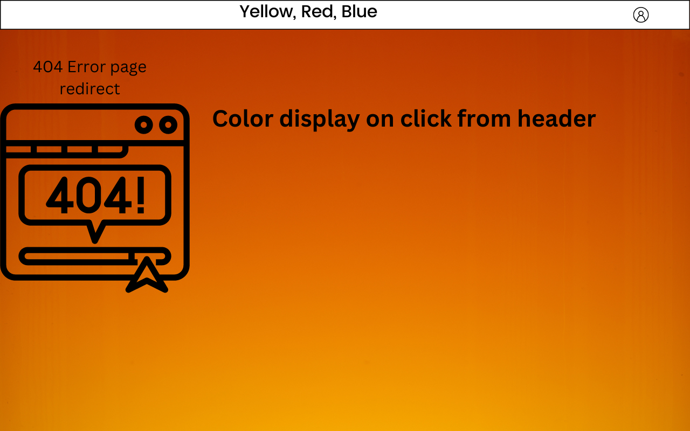

# Plan

 -Add components and folders
    -Header
        -Header.js
        -Header.css
    -Main
        -Main.css
        -Main.js
    -NotFound.Js

## steps

-Add browser router to index.js
-Add routes and switch to app js
-Add Navlinks to header components
-Add color display to Main
-Import header into main
-import everything into App js
-create notfound/404
-add styling
-finish and celebrate
